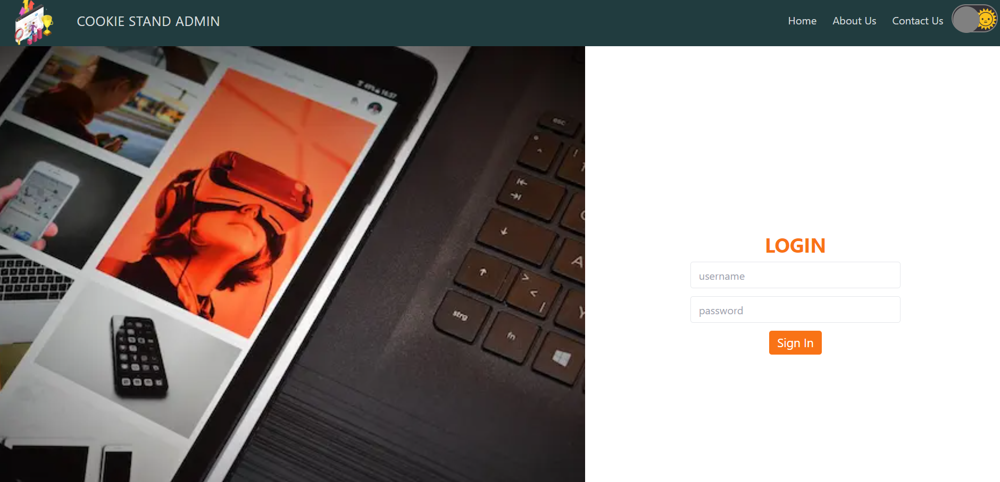
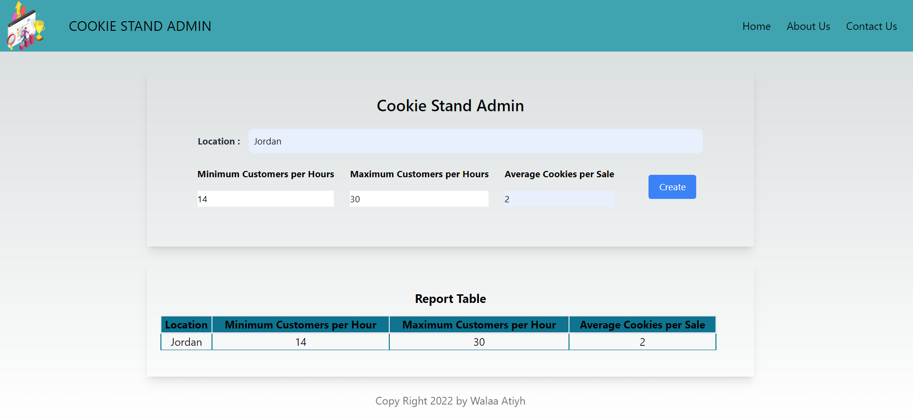
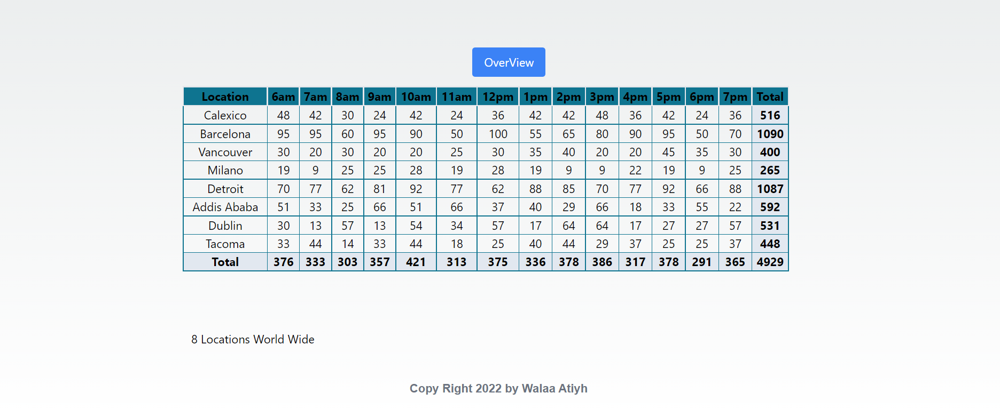
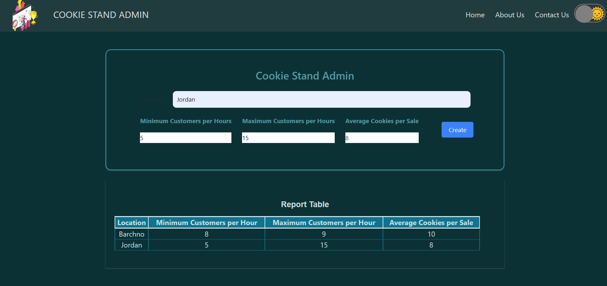
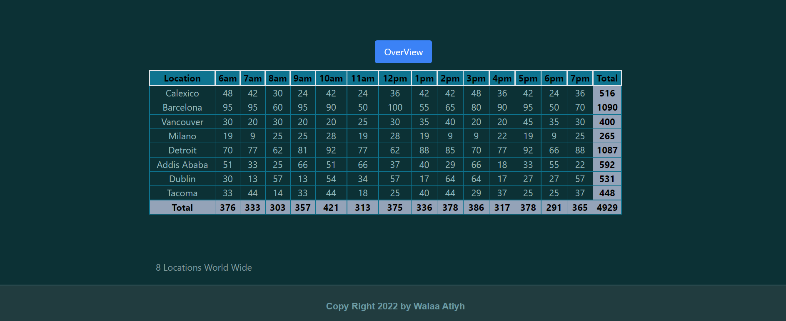
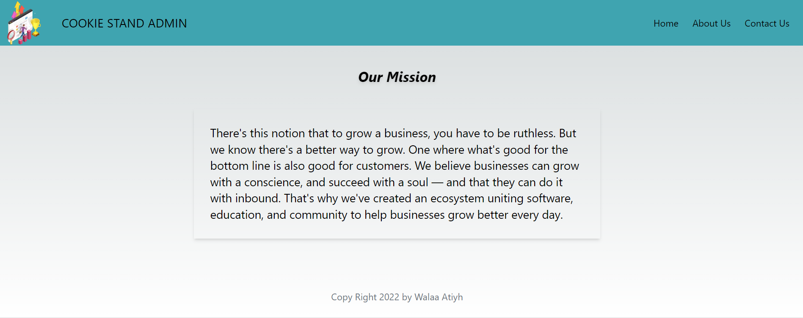
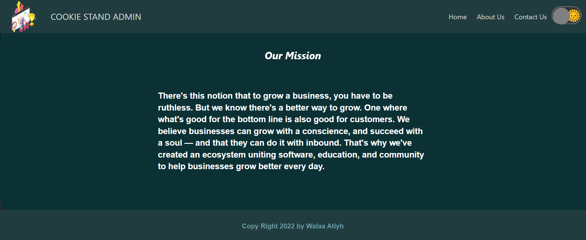

# LAB - Class 32 ,33,34

## Project: Intro to Next.js & TailwindCSS &Context API

## Author: Walaa' Atiyh

### Object :create a Cookie Stand Admin app using Next.js and style using Tailwind CSS.

### login 
      * username :Walaa
      * password :walaa

### [lab 32 Pull requests](https://github.com/WalaaAtiah/cookie-stand-admin/pull/1)
### [lab 33 Pull requests](https://github.com/WalaaAtiah/cookie-stand-admin/pull/3)
### [lab 34 Pull requests](https://github.com/WalaaAtiah/cookie-stand-admin/pull/4)
### [lab 35 Pull requests](https://github.com/WalaaAtiah/cookie-stand-admin/pull/6)

## picture for the application


1. **login page**
   
   
<br>

1. **home route** <http://localhost:3000/>

* Light theme  



* Dark theme



<br>

3. **about route** <http://localhost:3000/about>
   
   
   
   

<br>

4. **contact Us route** <http://localhost:3000/contactUs>
   
   
   
   
<br>


This is a [Next.js](https://nextjs.org/) project bootstrapped with [`create-next-app`](https://github.com/vercel/next.js/tree/canary/packages/create-next-app).

## Getting Started

First, run the development server:

```bash
npm run dev
# or
yarn dev
```

Open [http://localhost:3000](http://localhost:3000) with your browser to see the result.

You can start editing the page by modifying `app/page.jsx`. The page auto-updates as you edit the file.

[API routes](https://nextjs.org/docs/api-routes/introduction) can be accessed on [http://localhost:3000/api/hello](http://localhost:3000/api/hello). This endpoint can be edited in `pages/api/hello.js`.

The `pages/api` directory is mapped to `/api/*`. Files in this directory are treated as [API routes](https://nextjs.org/docs/api-routes/introduction) instead of React pages.

This project uses [`next/font`](https://nextjs.org/docs/basic-features/font-optimization) to automatically optimize and load Inter, a custom Google Font.

## Learn More

To learn more about Next.js, take a look at the following resources:

- [Next.js Documentation](https://nextjs.org/docs) - learn about Next.js features and API.
- [Learn Next.js](https://nextjs.org/learn) - an interactive Next.js tutorial.

You can check out [the Next.js GitHub repository](https://github.com/vercel/next.js/) - your feedback and contributions are welcome!

## Deploy on Vercel

The easiest way to deploy your Next.js app is to use the [Vercel Platform](https://vercel.com/new?utm_medium=default-template&filter=next.js&utm_source=create-next-app&utm_campaign=create-next-app-readme) from the creators of Next.js.

Check out our [Next.js deployment documentation](https://nextjs.org/docs/deployment) for more details.
